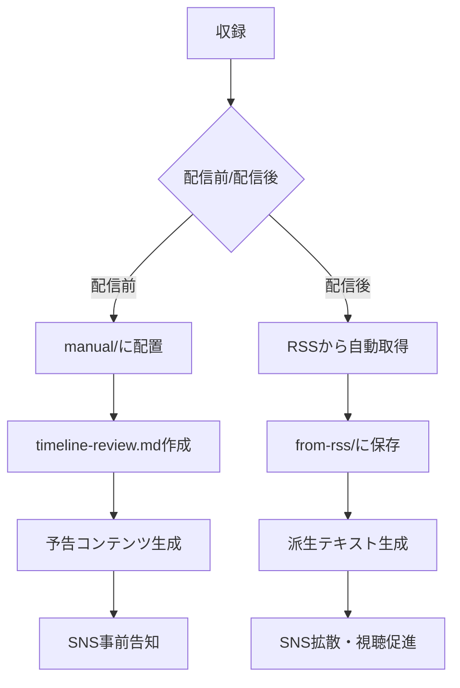

# KNOWフードラジオ ワークフロー図解

## 全体フロー



## 配信前ワークフロー（manual/）

### Day -7（1週間前）
1. timeline-review.mdを作成
2. preview.mdを生成
3. Instagram/Xで予告投稿

### Day -3（3日前）
1. teaser.mdを生成
2. カウントダウン投稿開始

### Day -1（前日）
1. 最終告知
2. リマインダー投稿

## 配信後ワークフロー（from-rss/）

### Day 0（配信当日）
1. fetch_transcript.pyで自動取得
2. 基本派生テキスト生成
   - summary.md
   - briefing.md
   - timeline.md
3. 即時SNS投稿

### Day +1（翌日）
1. highlights.md生成
2. 切り抜き動画作成用に活用
3. 追加SNS投稿

### Day +2〜7（1週間以内）
1. audience_engagement.txt活用
2. リスナーとの対話促進
3. 次回への期待醸成

## LLMへの依頼テンプレート

### 配信前（manual/）
```
以下のtimeline-review.mdから配信予告コンテンツを作成してください。
CONTENT_GUIDELINES.mdのmanual/専用ガイドラインに従ってください。

対象: manual/#30.1-お便り回/timeline-review.md
```

### 配信後（from-rss/）
```
以下の文字起こしから派生テキストを作成してください。
CONTENT_GUIDELINES.mdに従って品質基準を満たしてください。

対象: from-rss/第30回_XXX/transcript.srt
```

## 品質チェックポイント

### 作成前
- [ ] 対象ファイルの確認
- [ ] CONTENT_GUIDELINES.md参照
- [ ] templatesの確認

### 作成中
- [ ] 文字数制限の遵守
- [ ] トーンの統一
- [ ] 専門用語の説明

### 作成後
- [ ] チェックリスト確認
- [ ] ファイル名の正確性
- [ ] 配置場所の確認

## 効果測定

### 定量指標
- SNS投稿のエンゲージメント率
- 配信後の再生数増加率
- 切り抜き動画の視聴数

### 定性指標
- リスナーからのフィードバック
- コメントの質と量
- 新規リスナーの流入

## 改善サイクル

1. **週次**: 個別エピソードの振り返り
2. **月次**: 全体パフォーマンスレビュー
3. **四半期**: ガイドライン更新

詳細は[BEST_PRACTICES.md](BEST_PRACTICES.md)を参照。